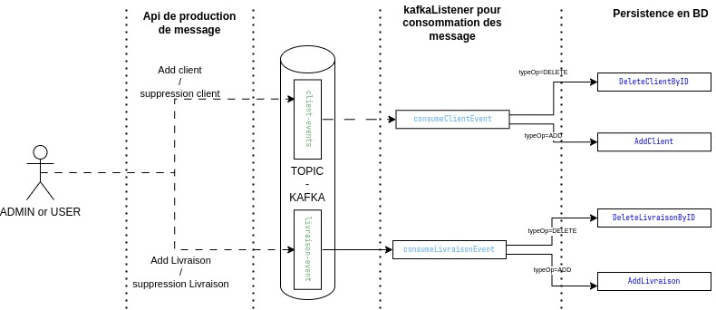
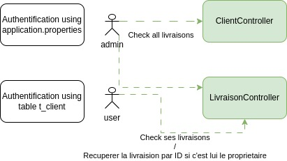

# README - Application de Gestion Client

## Exercice
### MVP
#### User Story
> En tant que client, je peux choisir mon mode de livraison.\
> Les modes de livraison disponibles sont : `DRIVE`, `DELIVERY`, `DELIVERY_TODAY`, `DELIVERY_ASAP`.

#### User Story
> En tant que client, je peux choisir mon jour et mon créneau horaire.\
> Les créneaux sont spécifiques au mode de livraison et réservable par d'autres clients.

### Features Bonus
Les fonctionnalités suivantes sont optionnelles et non exhaustives.\
Elles n'ont pas de priorité entre elles, vous pouvez implémenter celles qui vous intéressent ou en proposer d'autres.

#### API REST
- [x] Proposer une API REST consommable via http pour interagir avec les services réalisés dans le MVP
- [x] Implémenter les principes HATEOAS dans votre API REST
- [x] Sécuriser l'API
- [ ] Utiliser une solution non-bloquante
- [x] Documenter l'API REST

#### Persistence
- [x] Proposer une solution de persistence des données 
- [ ] Proposer une solution de cache

#### Stream (Bonus)
- [ ] Proposer une solution de streaming de données
- [x] Proposer une solution de consommation et/ou production d'évènements


## Conception Technique


### USE CASE Synthese Appels Asynchrone




### USE CASE Synthese Appels Synchrone



## Choix Techniques

L'application a été développée en utilisant :

- **Spring Boot** pour la gestion du backend
- **Spring Security** avec deux modes d’authentification :
    - Via fichier `application.properties`
    - Via la table `t_client` (email/mot_de_passe)
- **PostgreSQL** comme Système de Gestion de Base de Données (SGBD)
- **Liquibase** pour la gestion des migrations et mises à jour de la base de données
- **Kafka** pour la communication asynchrone entre services
- **Maven** pour la gestion des dépendances et du build


## Bibliothèque des Tables

| Nom de la Table  | Nom de l'Entité (Java) | champs de la table                                                       |
|------------------|------------------------|--------------------------------------------------------------------------|
| t_client         | ClientEntity           | id_client,nom,prenom,email,mot_de_passe,role                             |
| t_livraison      | LivraisonEntity        | id_livraison,date_creation,date_livrason,id_client_f,id_type_livraison_f |
| t_type_livraison | TypeLivraisonEntity    | id_type_livraison,type_livraison                                         |

_Pour faciliter la lecture et la compréhension de modele de base de données. Quelques precisions:_
- Toutes les tables commencent par "t_"
- Toutes les clés primaires commencent par "id_"
- Toutes les clés etrangeres finissent par "_f"
- Tous les IDs des tables sont suivis des noms des tables sans "_t"

## Critères d'Acceptance

### `addClient`
- [x] **Cas 1** : Vérifier si les champs ne sont pas au bon format (exemple : email invalide, mot de passe trop court, etc.).  
  **Attendu** : Une réponse HTTP `400 Bad Request` avec un message d'erreur indiquant que les champs ne respectent pas le format attendu. Les logs doivent enregistrer cette erreur de manière détaillée.

- [x] **Cas 2** : Si tous les champs sont au bon format, vérifier si l'insertion du client fonctionne correctement.  
  **Attendu** : Une réponse HTTP `201 Created` avec les détails du client créé dans le corps de la réponse. Les logs doivent confirmer que l'insertion a réussi.

### `addLivraison`
- [ ] **Cas 1** : Si l'`email_client` est introuvable, vérifier si une erreur est générée dans les logs.  
  **Attendu** : Une réponse HTTP `400 Bad Request` avec un message d'erreur indiquant que l'email du client est introuvable. Les logs doivent enregistrer cette erreur de manière détaillée.  
  
  : L'API crée l'event mais l'insertion n'est pas effectué.
 
- [ ] **Cas 2** : Si le `type` de livraison est hors de la liste prédéfinie `[DRIVE, DELIVERY, DELIVERY_TODAY, DELIVERY_ASAP]`, vérifier si une erreur est générée dans les logs.  
  **Attendu** : Une réponse HTTP `400 Bad Request` avec un message d'erreur indiquant que le type de livraison est invalide. Les logs doivent enregistrer cette erreur de manière détaillée.  
  
  : L'API crée l'event mais l'insertion n'est pas effectué.

- [x] **Cas 3** : Vérifier si l'insertion passe avec des données valides.  
  **Attendu** : Une réponse HTTP `201 Created` avec les détails de la livraison créée dans le corps de la réponse. Les logs doivent confirmer que l'insertion a réussi.

- [x] **Cas 4** : Vérifier si des erreurs sont générées lorsque la `date` ou d'autres champs ne sont pas au bon format.  
  **Attendu** : Une réponse HTTP `400 Bad Request` avec un message d'erreur indiquant que le format des données est invalide. Les logs doivent enregistrer cette erreur de manière détaillée.

### `getLivraisons`
- [x] **Cas 1** : L'ADMIN peut récupérer toutes les livraisons.  
  **Attendu** : Une réponse HTTP `200 OK` avec la liste complète des livraisons dans le corps de la réponse.

- [x] **Cas 2** : Le client doit récupérer uniquement les données le concernant.  
  **Attendu** : Une réponse HTTP `200 OK` avec une liste de livraisons filtrées pour ne contenir que celles dont le client est propriétaire.

### `getClients`
- [x] **Cas 1** : L'ADMIN peut récupérer la liste complète des clients.  
  **Attendu** : Une réponse HTTP `200 OK` avec la liste complète des clients dans le corps de la réponse.

- [ ] **Cas 2** : Un client (non ADMIN) ne peut récupérer qu'une liste contenant uniquement ses propres informations.  
  **Attendu** : Une réponse HTTP `200 OK` avec une liste contenant uniquement les informations du client connecté.

### `getLivraisonById`
- [x] **Cas 1** : Le client qui n'est pas propriétaire d'une livraison doit recevoir une erreur `"Livraison introuvable"`.  
  **Attendu** : Une réponse HTTP `404 Not Found` avec un message d'erreur approprié.

- [x] **Cas 2** : Le client peut récupérer une livraison dont il est propriétaire.  
  **Attendu** : Une réponse HTTP `200 OK` avec les détails de la livraison dans le corps de la réponse.

- [x] **Cas 3** : Vérifier les exceptions si l'ID de la livraison n'existe pas.  
  **Attendu** : Une réponse HTTP `404 Not Found` avec un message d'erreur indiquant que la livraison n'a pas été trouvée.

### `getClientById`
- [x] **Cas 1** : Le mot de passe doit être à `null` et le rôle doit être `ADMIN`.  
  **Attendu** : Une réponse HTTP `200 OK` avec les informations du client, où le champ `motDePasse` est `null` et le champ `role` est `ADMIN`.

- [x] **Cas 2** : Récupérer les données si l'utilisateur est bien connecté avec le compte de ce client.  
  **Attendu** : Une réponse HTTP `200 OK` avec les informations du client dans le corps de la réponse. Si l'utilisateur n'est pas connecté ou n'est pas autorisé, une réponse HTTP `403 Forbidden` doit être retournée.

- [x] **Cas 3** : Vérifier les exceptions si l'ID du client n'existe pas.  
  **Attendu** : Une réponse HTTP `404 Not Found` avec un message d'erreur indiquant que le client n'a pas été trouvé.

### `deleteLivraison`
- [x] **Cas 1** : Si l'ID de la livraison n'existe pas, vérifier si une erreur est générée.  
  **Attendu** : Une réponse HTTP `404 Not Found` avec un message d'erreur indiquant que la livraison n'a pas été trouvée. Les logs doivent enregistrer cette erreur de manière détaillée.

- [ ] **Cas 2** : Si l'ID existe, vérifier que la suppression est effectuée avec succès.  
  **Attendu** : Une réponse HTTP `204 No Content` pour indiquer que la suppression a réussi. Les logs doivent confirmer que la suppression a été effectuée.

### `deleteClient`
- [ ] **Cas 1** : Si l'ID du client n'existe pas, vérifier si une erreur est générée.  
  **Attendu** : Une réponse HTTP `404 Not Found` avec un message d'erreur indiquant que le client n'a pas été trouvé. Les logs doivent enregistrer cette erreur de manière détaillée.

- [ ] **Cas 2** : Si l'ID existe, vérifier que la suppression est effectuée avec succès.  
  **Attendu** : Une réponse HTTP `204 No Content` pour indiquer que la suppression a réussi. Les logs doivent confirmer que la suppression a été effectuée.

- [x] **Cas 3** : Si le client a des livraisons associées, vérifier que la suppression est bloquée ou que les livraisons sont également supprimées (selon la logique métier).  
  **Attendu** : Une réponse HTTP `400 Bad Request` avec un message d'erreur indiquant que le client ne peut pas être supprimé car il a des livraisons associées. Les logs doivent enregistrer cette erreur de manière détaillée.
## Points d'Amélioration

Lors du développement de l'application, plusieurs aspects nécessitent une revue et des améliorations :

- **Sécurisation des mises à jour des données** :  
  Actuellement, les clients peuvent ajouter ou supprimer des livraisons même s’ils ne sont pas propriétaires de celles-ci. Il est nécessaire d'ajouter des contrôles d’accès basés sur l'utilisateur authentifié et ses permissions.

- **Revue de l'architecture hexagonale** :  
  Bien que l’application suive les principes de l'architecture hexagonale, une analyse plus approfondie est requise pour s’assurer que les dépendances entre les couches respectent les bonnes pratiques et restent découplées.

- **Modularité de l’application** :  
  Une meilleure séparation des responsabilités pourrait être envisagée afin de faciliter la maintenabilité et l'évolution du projet. Cela inclut l'amélioration des ports et adaptateurs pour éviter le couplage direct entre le domaine et les infrastructures.

- **Gestion des créneaux spécifiques au mode de livraison** :  
  Actuellement, la gestion des créneaux horaires en fonction du mode de livraison (par exemple, `DRIVE`, `DELIVERY`, `DELIVERY_TODAY`, `DELIVERY_ASAP`) n'est pas implémentée. Il est nécessaire d'ajouter une logique pour gérer les créneaux disponibles en fonction du type de livraison sélectionné, tout en respectant les contraintes métier (par exemple, les horaires d'ouverture, les délais de préparation, etc.).

Ces points peuvent être objet d’une analyse plus approfondie afin de renforcer la robustesse, la sécurité et la fonctionnalité de l’application.

## Versions et Technologies

Vue sur quelques technologies utilisées:

| Technologie     | Version | Description |
|-----------------|---------|-------------|
| **Maven**       | 3.9.9   | Framework utilisé pour le développement du backend |
| **Spring Boot** | 3.4.2   | Framework utilisé pour le développement du backend |
| **Java**        | 21      | Langage de programmation utilisé |
| **Git**         | Latest  | Gestionnaire de version pour le dépôt du projet |
| **PostgreSQL**  | Latest  | Système de gestion de base de données relationnelle (SGBD) |
| **Kafka**       | Latest  | Système de messagerie pour la communication asynchrone |

## Lancement application

Pour lancer l'application, suivez les étapes suivantes :

1. **Ouvrez un terminal** et naviguez jusqu'au répertoire du projet :

   ```bash
   cd ../gestionClient

2. **Compilez et packagez** l'application avec Maven :

   ```bash
   mvn clean install

3. **Lancez le conteneur Docker** :

   ```bash
   docker-compose up -d

4. **Accédez à l'application** en ouvrant un navigateur et en allant à l'adresse suivante (login: admin|Mot de passe:adminpassword):

   ```bash
   http://localhost:8080/swagger-ui/index.html